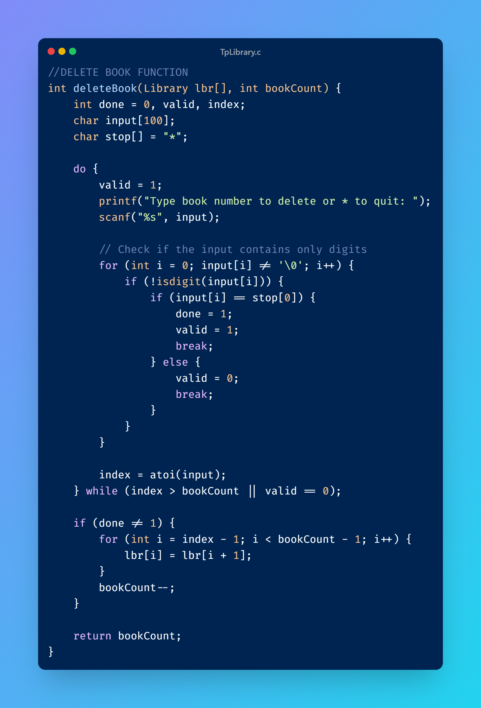

# Library Management System (C)

## Overview
A C-based library management system with robust input validation and user-friendly features.

## Getting Started

### 1. Clone the Repository
To get a local copy of this project, run this command in your terminal:

```bash
git clone https://github.com/gitallaaEddine/ProjectTP.git
````

 ### 2. Navigate to Project Directory
````bash
cd ProjectTP
````

### 3.Compile and Run
````bash
gcc TpLibrary.c -o library
./library
````

## Core Functions :
(This are not the whole functions just highlights for the main titles in the function to explain them you can find the function in the C file code or in the screenshots)

## 0.MAIN
## Main Function Overview
````c
int main() {
    Library lbr[50];
    int choiceValue;
    int bookCount = 0;
    int done ,index, valid, match;
    char input[100]; 
    char stop[] = "*";
    char bookTitle[30];
    do
    {
        choiceValue = userChoice();
        
        if (choiceValue == 1) // adding books
        {
        printf("when you are done adding books enter * \n\n");
            do
            {
                lbr[bookCount] = addBook(lbr[bookCount], done);   // each time the user enter a book , it is added to lbr[]
                done = stopAdding(lbr[bookCount], done);
                if (done == 0)
                {
                    bookCount++;
                }
            } while (done == 0);
            done = 0;
        }else if (choiceValue == 2) // looking for books
        {
            searchBook(lbr, bookCount);
        }else if (choiceValue == 3) // displaying books
        {
            displayLibrary(lbr, bookCount);
        }else if (choiceValue == 4) // deleting books
        {
            bookCount = deleteBook(lbr, bookCount);
             } 
            } while(choiceValue != 0);
            printf("Exiting the Programme....");
return 0;
}
````
The main function includes the entire program:
````yaml
• Initializes the library and book count
• Enters a loop that presents the menu and processes user choices
• Calls the appropriate functions based on user input
• Exits when the user chooses option 0
````


### userChoice Function
````c
int userChoice() {
    int choice;
    printf("                === library === \n          1. add a book\n          2. look for a book by title\n          3. log all books\n          4. delete a book\n          0. quite\n\n enter your choice: ");
    scanf("%d", &choice);
    printf("\n");
    printf("choice : %d \n\n", choice);
    while (getchar() != '\n');  
    return choice;
}
````
Code Explanation:
````yaml
Displays main menu options
Reads user's choice using scanf
Clears input buffer using while (getchar() != '\n')
Returns the selected choice
````

## 1. addBook Function
````c
Library addBook(Library b, int done)  {

    do {
        // Get book title with validation
        printf("enter the book title:");
        fgets(b.title, sizeof(b.title), stdin);

        // Title validation loop - minimum 2 characters
        if (strlen(b.title) < 2) {
            do {
                printf("please enter a correct title:");
                fgets(b.title, sizeof(b.title), stdin);
                done = stopAdding(b, done);
            } while (strlen(b.title) < 2 && done == 0);
        }
        // ...existing code...
    } while (condition);
}
````
Code Explanation:
````yaml
• Uses a do-while loop to continuously prompt for input until valid or user quits
• fgets reads input including spaces (safer than scanf)
• Nested validation loop checks title length >= 2
• stopAdding checks for "*" escape character after each input
• Similar validation patterns for author and ISBN
• Returns updated library structure
````
**Example of inputs and Invalid Input Handling:**
```yaml
Enter the book title: A
Please enter a correct title: Harry Potter

Enter the book author: J.K
Please enter a correct full author name: J.K. Rowling

Enter the book ISBN: 12345A7890123
ISBN must be 13 digits and contain only numbers: 9783161484100
```
### the next funtions are nested functions of the addBook function

#### 1.1. stopAdding Function
````c
int stopAdding(Library s, int done) {
    char stop[] = "*";
    
    // Check title, author, and ISBN for "*"
    if(strstr(s.title, stop) || 
       strstr(s.author, stop) || 
       strstr(s.isbn, stop)) {
        return 1;
    }
    return 0;
}
````
Code Explanation:
````yaml
• Uses strstr to search for "*" substring
• Checks all three fields (title, author, ISBN)
• Returns 1 if "*" found, 0 otherwise
• Single responsibility principle - only handles escape detection
````
#### 1.2. ISBNvalidation Function
````c
int ISBNvalidation(Library I) {
    int i = 0;
    int valid = 1;
    
    // Check each character
    while(I.isbn[i] != '\0' && I.isbn[i] != '\n') {
        if(!isdigit(I.isbn[i])) {
            valid = 0;
            break;
        }
        i++;
    }
    
    // Verify length
    if(i != 13) {
        valid = 0;
    }
    
    return valid;
}
````
Code Explanation:
````yaml
• while loop processes each character until end or newline
• isdigit checks if character is numeric
• Counter i tracks ISBN length
• Validation fails if non-digit found or length != 13
• Returns boolean validation result
````


## 2. searchBook Function
````c
void searchBook(Library s[], int n) {
    char searchTitle[50];
    int found = 0;
    
    printf("Enter title to search: ");
    fgets(searchTitle, sizeof(searchTitle), stdin);
    
    // Loop through library array
    for(int i = 0; i < n; i++) {
        // Case-insensitive comparison
        if(stricmp(s[i].title, searchTitle) == 0) {
            // Display book details
            found = 1;
            break;
        }
    }
}
````
Code Explanation:
```yaml
• Uses for loop to iterate through library array
• stricmp performs case-insensitive string comparison
• Boolean flag found tracks search success
• Early exit when match found
• Handles "*" escape sequence
```
Example:
```yaml
Type book title: harry potter
Matching title found:
   Title: Harry Potter
```
```yaml
Type book title: the unknow
Matching title found:
   No matching titles
```
Screenshot:


## 3. displayLibrary Function
````c
void displayLibrary(Library l[], int n) {
    for(int i = 0; i < n; i++) {
        printf("\n%d. \n", i+1);
        printf("   Title: %s", l[i].title);
        printf("   Author: %s", l[i].author);
        printf("   ISBN: %s\n", l[i].isbn);
    }
}
````
Code Explanation:
```yaml
• Simple for loop traverses array
• Formatted printing with consistent indentation
• Index numbering starts at 1 for user-friendliness
• Each book displayed with complete details
```
Output Format:
```yaml
Books in library:
1.
   Title: Harry Potter
   Author: J.K. Rowling
   ISBN: 9783161484100

2.
   Title: The Great Gatsby
   Author: F. Scott Fitzgerald
   ISBN: 9780743273565
```
Screenshot:


## 4. deleteBook Function
````c
int deleteBook(Library lbr[], int bookCount) {
    int done = 0, valid, index;
    char input[100];
    char stop[] = "*";

    do {
        valid = 1; 
        printf("Type book number to delete or * to quit: ");
        scanf("%s", input); 

        for (int i = 0; input[i] != '\0'; i++) {
            if (!isdigit(input[i])) {
                if (input[i] == stop[0]) {
                    done = 1;
                    valid = 1;
                    break; 
                } else {
                    valid = 0;
                    break;
                }
            }
        }

        index = atoi(input); 
    } while (index > bookCount || valid == 0);

    if (done != 1) {
        for (int i = index - 1; i < bookCount - 1; i++) {
            lbr[i] = lbr[i + 1];
        }
        bookCount--;
    }

    return bookCount;
}
````

**Code Explanation:**
```yaml
• Accepts user input for book number or "*" to quit
• Validates input is numeric or escape character
• Shifts books left to remove selected book
• Updates total book count
```

**Output Format:**
```yaml
Type book number to delete or * to quit: 2

Before deletion:
1.
   Title: Harry Potter
   Author: J.K. Rowling
   ISBN: 9783161484100

2.
   Title: The Great Gatsby
   Author: F. Scott Fitzgerald
   ISBN: 9780743273565

After deletion:
1.
   Title: Harry Potter
   Author: J.K. Rowling
   ISBN: 9783161484100
```


